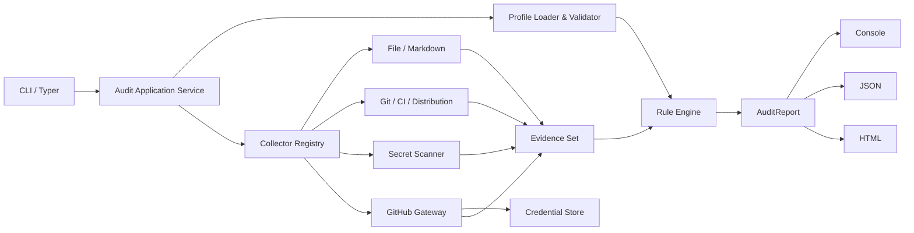
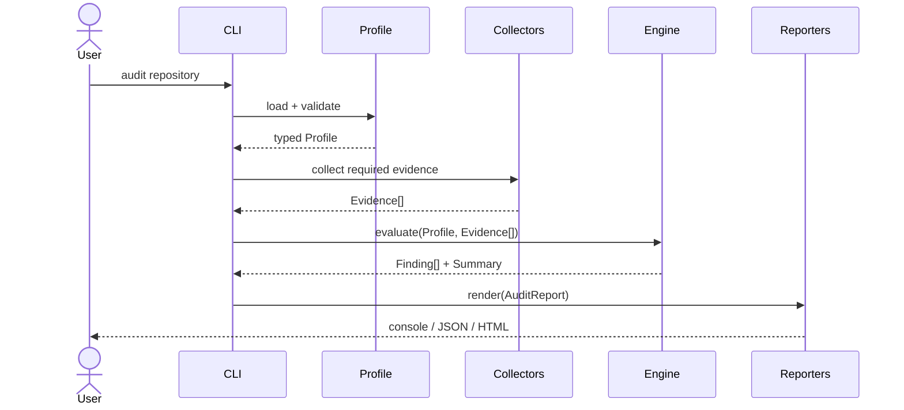

# RepoProof 软件需求规约

## 0. 文档信息

- **项目**：RepoProof
- **方向**：AI4SE 期末项目 B（非 Harness 应用类项目）
- **规约版本**：1.0
- **Profile schema**：1
- **Report schema**：1
- **设计状态**：四节设计均已由学生批准；本文等待最终书面审阅
- **交付形态**：CLI + GitHub Release，不开发 WebUI

RepoProof 是一个离线优先、默认只读的发布前仓库审计 CLI。它把课程要求或团队发布约定表达为声明式 profile，采集本地仓库及可选 GitHub 远程证据，生成确定、可复核的合规报告。

---

## 1. 问题陈述

### 1.1 问题

学生和小型开发团队常在提交或发布前才发现：

- 必备文档或章节缺失；
- CI 文件存在但关键 job 名称错误；
- 测试、分发和 Release 配置不完整；
- commit、分支或过程证据不足；
- 仓库包含疑似 API Key、Token 或敏感文件；
- 人工检查结果不可重复，且难以作为 CI 门禁。

这些规则通常散落在作业文档、团队 wiki 和口头约定里。人工逐项核对成本高、容易遗漏，也不能稳定复现。

### 1.2 目标用户

1. **课程项目学生**：提交前检查仓库是否满足显式交付要求。
2. **课程助教或 reviewer**：使用相同 profile 获得可复核报告。
3. **小型开发团队维护者**：在发布前执行轻量、声明式仓库审计。
4. **CI 维护者**：通过稳定退出码把发布要求变成自动门禁。

### 1.3 价值主张

> 用一条本地命令把散落的交付规则转换成确定性检查，在提交或发布之前发现文档、CI、Git 过程、分发和疑似凭据问题，并生成可供人和机器复核的证据报告。

### 1.4 成功指标

- 对本地 Git 仓库执行一条命令即可完成审计。
- 相同仓库快照与相同 profile 产生相同结论。
- 核心离线审计不依赖 LLM、网络或真实凭据。
- 终端、JSON 和 HTML 报告对每条规则给出相同状态。
- CI 能通过退出码区分“通过”“存在阻塞发现”“配置错误”“运行错误”。
- Secret 发现从不回显匹配原文。
- Windows x64 用户可从 GitHub Release 下载单文件可执行程序运行。

### 1.5 明确不做

- 不自动修改或修复目标仓库。
- 不上传源代码或报告。
- 不使用 LLM 判断规则是否满足。
- 不执行 profile 中的脚本、表达式或动态导入。
- 不替代专业 SAST、依赖漏洞或完整 Secret 扫描产品。
- 1.0 不提供 WebUI、IDE 插件、后台服务或数据库。
- 1.0 不承诺 macOS/Linux 原生二进制；源码安装可以跨平台使用。

---

## 2. 用户故事

### US-01：本地仓库一键审计

作为准备提交项目的学生，我希望对本地仓库运行一次审计，以便在提交前看到所有阻塞项和警告。

**验收**：

- `repoproof audit --profile ai4se-b .` 在无网络环境可运行。
- 每条规则输出状态、说明、证据位置和修复建议。
- 命令不修改被审计仓库中的文件。

### US-02：使用内置课程模板

作为 AI4SE 学生，我希望直接使用 `ai4se-b` profile，以便无需手写课程规则。

**验收**：

- `repoproof profile list` 列出 `ai4se-b`。
- 模板至少检查课程文档、README 章节、`.gitlab-ci.yml` 的 `unit-test` job、测试入口、分发配置、Git 过程和疑似凭据。

### US-03：验证自定义规则

作为团队维护者，我希望验证自己的 YAML profile，以便在审计前发现无效字段、重复规则 ID 和不支持的规则类型。

**验收**：

- `repoproof profile validate policy.yml` 在不扫描仓库的情况下验证 profile。
- 错误包含 YAML 路径、原因和退出码 2。
- profile 不能声明任意代码执行。

### US-04：把审计接入 CI

作为 CI 维护者，我希望 RepoProof 使用稳定退出码和 JSON 报告，以便构建系统可靠判定是否允许发布。

**验收**：

- 无 FAIL 时退出 0；存在 FAIL 时退出 1。
- CLI/profile 错误退出 2；运行错误退出 3。
- JSON 遵循 `report_schema: 1`，字段顺序不影响语义。

### US-05：生成可人工审阅的报告

作为 reviewer，我希望得到自包含 HTML 报告，以便不安装 RepoProof 也能查看结论和证据。

**验收**：

- `--format html --output report.html` 生成单文件 HTML。
- HTML 不引用外部脚本、字体、图片或 CDN。
- HTML、JSON 和终端报告的规则状态完全一致。

### US-06：安全发现疑似凭据

作为仓库所有者，我希望在发布前发现疑似 Secret，但不希望扫描器把 Secret 再次泄露到终端或报告。

**验收**：

- 发现包含文件、行号、类别和短指纹。
- 匹配原文在所有输出中替换为 `<redacted>`。
- 测试断言真实 fixture Secret 不出现在 stdout、stderr、JSON 或 HTML。

### US-07：安全配置 GitHub Token

作为需要检查私有仓库远程状态的用户，我希望安全录入、查看状态、更新和清除 Token，以免把凭据写入仓库。

**验收**：

- `auth login` 使用隐藏输入并写入系统钥匙串。
- `auth status` 仅显示“已配置/未配置”和目标主机。
- 再次 `auth login` 更新凭据；`auth logout` 清除凭据。
- 任何命令均不回显 Token。

### US-08：在没有 Token 或网络时继续离线审计

作为离线用户，我希望远程证据不可用时本地检查仍能完成，以免网络问题掩盖真正的本地发现。

**验收**：

- 未启用远程规则时不访问网络。
- 远程规则缺少 Token 时为 SKIP，并给出配置说明。
- 网络错误不改变已完成本地规则的状态；命令最终退出 3。

---

## 3. 功能规约

## 3.1 CLI 与审计编排

### 命令

```text
repoproof audit [REPOSITORY] [--profile NAME_OR_PATH]
                [--format console|json|html]...
                [--output PATH] [--offline] [--no-color] [--verbose]
repoproof profile list
repoproof profile validate PROFILE_PATH
repoproof auth login [--host github.com]
repoproof auth status [--host github.com]
repoproof auth logout [--host github.com]
repoproof version
```

### 输入

- `REPOSITORY`：本地目录，默认当前目录。
- `--profile`：内置 profile 名称或本地 YAML 路径；默认 `ai4se-b`。
- `--format`：可重复，默认 `console`。
- `--output`：单个文件或输出目录。选择多个非 console 格式时必须是目录。
- `--offline`：禁止远程 Collector。

### 行为

1. 解析命令并规范化仓库路径。
2. 加载并验证 profile。
3. 创建只读审计上下文。
4. 依次运行适用 Collector。
5. 将 Evidence 交给 Rule Engine。
6. 构造唯一 AuditReport。
7. 由选定 Reporter 渲染。
8. 根据审计状态或程序错误返回稳定退出码。

### 输出

- console：人类可读摘要与 findings。
- json：UTF-8、schema 版本化的机器可读报告。
- html：UTF-8 自包含报告。

### 边界与错误

- 仓库不存在、不是目录或不可读：退出 3。
- profile 不存在或无效：退出 2。
- 输出路径在仓库内时允许写入，但写入发生在所有扫描完成后；默认输出到 stdout。
- `--offline` 与需要远程证据的规则同时出现时，该规则为 SKIP。
- 未捕获异常必须转为不含敏感数据的错误摘要并退出 3。

## 3.2 Profile 与规则引擎

### Profile schema

```yaml
schema: 1
name: ai4se-b
description: AI4SE B project release-readiness checks
rules:
  - id: docs.spec
    type: path_exists
    severity: error
    params:
      paths: [SPEC.md]
    remediation: Add the required specification document.
```

### 规则通用字段

- `id`：profile 内唯一，匹配 `^[a-z0-9][a-z0-9._-]{2,63}$`。
- `type`：注册表中的预定义规则类型。
- `severity`：`error` 或 `warning`。
- `params`：由对应规则模型校验，禁止额外字段。
- `remediation`：1–500 字符，不能为空。

### 1.0 规则类型

1. `path_exists`
   - 输入：相对路径或 glob 列表、最小匹配数。
   - 判断：匹配数是否达到要求。
2. `markdown_sections`
   - 输入：文件路径、必备标题及可选别名。
   - 判断：解析后的标题层级中是否存在规范化标题。
3. `ci_job_exists`
   - 输入：CI 类型、文件路径、job 名称。
   - 判断：YAML 顶层 job 是否存在；GitHub Actions 忽略保留键。
4. `git_history`
   - 输入：最小 commit 数、是否要求非默认分支、是否接受本地 merge 或远程 PR 作为过程证据。
   - 判断：使用 Git adapter 的本地历史；启用远程 PR 条件时也可使用 GitHub Evidence。远程证据不可用且本地条件不足时返回 SKIP，而不是猜测。
5. `distribution_ready`
   - 输入：允许的打包方式、必备配置路径、是否要求 Release workflow，以及是否接受已发布 Release。
   - 判断：至少一种本地打包组合完整；Release 条件可由本地 workflow 或可选 GitHub Release Evidence 满足。
6. `secret_scan`
   - 输入：启用的模式类别、熵阈值、排除路径。
   - 判断：SecretCollector 是否产生未被 allowlist 抑制的发现。

### 结果语义

- `PASS`：规则条件满足。
- `WARN`：warning 级规则不满足。
- `FAIL`：error 级规则不满足。
- `SKIP`：前置证据不可用、用户禁用或 offline 阻止。

规则执行不得抛出面向用户的裸异常。单条规则缺少所需 Evidence 时返回 SKIP；profile 模型错误在执行前退出 2。

## 3.3 Evidence Collectors

### FileCollector

- 枚举仓库根目录内候选路径。
- 使用 `.gitignore` 与 `.repoproofignore`。
- 不跟随指向仓库外的符号链接。
- 产出路径存在性、类型、大小与相对路径，不保存文件全文。

### MarkdownCollector

- 仅读取规则引用的 Markdown 文件。
- 解析 ATX 与 Setext 标题，统一大小写和连续空白。
- 单文件超过 2 MiB 时返回超限 Evidence。
- 无法解码 UTF-8 时返回不可解析 Evidence。

### GitCollector

- 通过参数数组调用本机 `git`，不经过 shell。
- 设置超时并限制输出大小。
- 产出是否为仓库、当前分支、commit 数、分支列表和合并记录。
- Git 不存在或目录不是仓库时提供不可用 Evidence。

### CICollector

- 解析 `.gitlab-ci.yml` 和 `.github/workflows/*.yml|yaml`。
- 禁止 YAML 自定义对象构造。
- 只检查静态结构，不执行 CI 脚本。
- YAML alias 展开和输入大小受限。

### DistributionCollector

- 识别 `pyproject.toml`、PyInstaller spec、Dockerfile、npm/cargo 等声明式打包入口。
- 检查 Release workflow 是否存在，但不声称产物已发布；远程发布状态由 GitHubCollector 提供。

### SecretCollector

- 检查常见 Token 前缀、私钥头、赋值上下文中的高熵字符串和敏感文件名。
- 默认跳过 `.git`、依赖缓存、二进制、报告输出和超限文件。
- 对匹配值只保留类别与 SHA-256 前 8 位短指纹。
- allowlist 只能依据规则 ID、路径和短指纹，不能把 Secret 原文写入配置。

### GitHubCollector（可选）

- 仅在 profile 使用远程规则且未指定 `--offline` 时运行。
- 默认主机固定为 `github.com`；其他主机必须显式配置并为 HTTPS。
- 产出最近 Actions 状态、默认分支和 Release 元数据。
- Token 缺失时返回不可用 Evidence；401/403 不打印响应中的敏感头。

## 3.4 报告

所有 Reporter 只消费 AuditReport，不重新计算规则。

### console

- 默认按 FAIL、WARN、SKIP、PASS 排序。
- 非 TTY 或 `--no-color` 时不输出 ANSI 控制符。
- 默认只展示失败、警告和跳过；`--verbose` 展示 PASS。

### JSON

- 顶层包含 `report_schema: 1`、工具版本、时间、仓库、profile、summary、findings、diagnostics。
- 路径以仓库相对 POSIX 形式表示。
- 不包含文件全文、Token、Secret 原文或系统钥匙串信息。

### HTML

- 从同一 JSON 兼容模型生成。
- 自包含 CSS，不使用 JavaScript 或外部资源。
- 对所有用户内容进行 HTML 转义。
- 页面显示 schema、工具版本和生成时间。

## 3.5 凭据管理

### 录入

- `auth login` 使用 `getpass` 隐藏输入。
- 空输入、非交互 stdin 或钥匙串不可用时失败，不回退到明文文件。
- 写入 service `repoproof.github`、account `<host>`。

### 查看状态

- `auth status` 只显示 host、`configured: yes|no` 和 keyring backend 名称。
- 不显示 Token 长度、前后缀或短指纹。

### 更新与清除

- 再次 `auth login` 原子覆盖同 host 凭据。
- `auth logout` 删除同 host 凭据；不存在时幂等成功。

### 使用

- GitHubGateway 按请求即时读取，不写入对象 repr、日志或报告。
- Token 只进入 HTTPS Authorization header。
- 1.0 不支持命令参数传 Token，也不自动读取 `.env`。

---

## 4. 非功能性需求

## 4.1 性能

- 目标仓库不超过 10,000 个候选文件、500 MiB 时，离线审计在 4 核开发机上 15 秒内完成。
- 单文件默认读取上限 2 MiB。
- 默认候选文件上限 20,000；超过后产生诊断并退出 3，禁止无界扫描。
- Git 命令和单次 GitHub 请求默认 10 秒超时。
- HTML/JSON 报告写入采用临时文件后原子替换，避免半成品。

## 4.2 安全与隐私

- 默认只读目标仓库；只有显式报告输出路径可写。
- 规范化路径必须位于仓库根目录内。
- 不跟随越界符号链接。
- YAML 使用安全解析和严格 schema。
- profile 不具备代码执行能力。
- Secret 原文不得出现在 stdout、stderr、日志、异常、JSON、HTML 或测试快照。
- Token 只存系统钥匙串。
- 不上传仓库内容；网络功能默认按需启用。
- HTML 对用户内容转义，防止本地报告中的脚本注入。

## 4.3 可用性

- 帮助文本包含最短可运行示例。
- 错误指出发生阶段、用户可执行的修复和退出码含义。
- Windows PowerShell、Windows Terminal 和非彩色 CI 日志均可读。
- 输出和配置使用 UTF-8，支持中文路径与 Markdown 标题。

## 4.4 可观测性

- 默认只输出用户可执行诊断，不输出堆栈。
- `--verbose` 输出阶段、Collector 耗时和被跳过原因，但不输出文件内容。
- 测试环境可注入时钟、网络 transport、keyring backend 与 Git runner。
- AuditReport 记录各阶段耗时，便于性能回归测试。

## 4.5 可靠性与可移植性

- 规则引擎和离线 Collector 不依赖操作系统全局状态。
- 没有 Git、keyring 或网络时提供确定的降级或错误语义。
- Python 3.12 和 3.13 均运行测试。
- Windows x64 单文件产物在干净 GitHub-hosted runner 执行 smoke test。

---

## 5. 系统架构



### 5.1 依赖方向

- CLI 依赖 application service，不依赖具体 Collector。
- application service 依赖 Collector、RuleEngine、Reporter 的协议。
- RuleEngine 只依赖领域模型。
- GitHubGateway 依赖 CredentialStore 协议和 HTTP transport。
- 领域模型不依赖 Typer、Rich、HTTPX、keyring 或文件系统。

### 5.2 审计时序



### 5.3 外部依赖

- 本机 Git 可执行程序：只读历史采集。
- GitHub REST API：仅用于可选远程状态。
- 操作系统钥匙串：仅用于可选 Token。
- GitHub Actions：测试、构建和 Release。
- GitLab CI 配置：课程要求的 `unit-test` job。
- 不调用 LLM。

---

## 6. 数据模型

### Profile

| 字段 | 类型 | 约束 |
|---|---|---|
| schema | int | 必须为 1 |
| name | str | 3–64 字符 |
| description | str | 1–500 字符 |
| rules | list[Rule] | 至少 1 条，ID 唯一 |

### Rule

| 字段 | 类型 | 约束 |
|---|---|---|
| id | str | 稳定、唯一、受限字符集 |
| type | enum | 六种预定义类型之一 |
| severity | enum | error / warning |
| params | typed object | 按规则类型严格校验 |
| remediation | str | 非空、最多 500 字符 |

### Evidence

| 字段 | 类型 | 说明 |
|---|---|---|
| id | str | 单次报告内唯一 |
| kind | str | 采集器定义的稳定类别 |
| subject | str | 仓库相对路径或逻辑对象 |
| state | enum | available / unavailable / limited |
| facts | mapping | 仅含规则所需的结构化事实 |
| provenance | mapping | Collector 名称、版本、时间 |

### Finding

| 字段 | 类型 | 说明 |
|---|---|---|
| rule_id | str | 对应 Rule |
| status | enum | PASS / WARN / FAIL / SKIP |
| severity | enum | error / warning |
| message | str | 不含敏感数据 |
| locations | list | 仓库相对路径与可选行号 |
| evidence_ids | list[str] | 引用 Evidence |
| remediation | str | 可执行修复建议 |

### AuditReport

| 字段 | 类型 | 说明 |
|---|---|---|
| report_schema | int | 必须为 1 |
| tool_version | str | 语义化版本 |
| generated_at | datetime | UTC ISO 8601 |
| repository | mapping | 显示名与规范化根目录 |
| profile | mapping | 名称、schema、内容摘要 hash |
| summary | mapping | 各状态计数和最终退出码 |
| findings | list[Finding] | 按稳定规则排序 |
| diagnostics | list | 运行级诊断 |
| timings | mapping | 阶段耗时 |

### 关系与约束

- 一个 Profile 包含多条 Rule。
- 一个 AuditReport 对应一个 Profile 和一个仓库快照。
- Finding 必须引用存在的 Rule；可引用零到多个 Evidence。
- Evidence facts 不得存文件全文或 Secret 原值。
- Reporters 不得修改 AuditReport。
- 稳定排序键为：状态优先级、rule_id、location。

---

## 7. 内置 `ai4se-b` Profile

1. 必备文件：
   - `SPEC.md`
   - `PLAN.md`
   - `SPEC_PROCESS.md`
   - `README.md`
   - `AGENT_LOG.md`
   - `REFLECTION.md`
   - `.gitlab-ci.yml`
2. README 必备章节：
   - 项目简介
   - 安装
   - 运行
   - 测试
   - 分发
   - 目录结构
   - 安全边界
   - 已知限制
3. `.gitlab-ci.yml` 存在 `unit-test` job。
4. 至少一种一键测试入口存在：`Makefile`、`pyproject.toml`、`package.json`、`Cargo.toml` 或 profile 指定路径。
5. 至少一种分发配置存在。
6. Git 仓库至少包含 5 个 commit；缺少可识别 PR/merge 证据为 WARN。
7. GitHub Actions 测试 workflow 缺失为 WARN，因为课程原文与 GitLab 要求存在冲突。
8. Release workflow 或已发布 Release 缺失为 FAIL。
9. Secret 扫描发现常见 Token、私钥或敏感文件为 FAIL。
10. PLAN 中没有完成项 commit hash 为 WARN；该规则只检查可识别的 Markdown 格式，不声称理解自然语言。

Profile 只编码可确定性判断的要求。无法可靠自动判断的“反思质量”“模块职责是否清晰”等内容不伪装成自动结论，而在报告中列入人工复核清单。

---

## 8. 凭据威胁模型与对策

| 威胁 | 后果 | 对策 |
|---|---|---|
| Token 硬编码或提交 Git | 凭据长期泄漏 | 不提供配置文件 Token 字段；Secret 扫描；`.gitignore` |
| Token 出现在命令参数 | 被 history/进程列表读取 | 只允许隐藏交互输入 |
| Token 出现在日志/报告 | 二次泄漏 | 敏感类型不实现 repr；集中脱敏；泄漏回归测试 |
| 明文 fallback | 钥匙串失败后落盘 | 钥匙串不可用即失败，不自动降级 |
| 恶意 profile 执行代码 | 本机代码执行 | 严格 schema、预定义规则、safe YAML |
| 路径遍历或越界 symlink | 读取仓库外数据 | resolve + root containment；越界链接跳过 |
| 超大/压缩/二进制输入 | 资源耗尽 | 文件数、总量、单文件、输出和超时上限 |
| HTML 中嵌入仓库内容 | 本地脚本执行 | HTML 转义；无 JavaScript；无外部资源 |
| GitHub 401/403 响应泄密 | Header 或正文泄漏 | 丢弃敏感头；只记录状态类别与 request id |
| 报告写入中断 | 半成品被误用 | 临时文件 + 原子替换 |

### 凭据生命周期

1. 首次远程审计提示用户先运行 `auth login`。
2. 隐藏输入读取 Token。
3. 写入系统钥匙串。
4. `auth status` 仅检查是否存在。
5. 再次 login 更新；logout 删除。
6. GitHubGateway 请求时短暂读取，使用后不缓存到磁盘。

---

## 9. 分发设计

### 目标产物

- `repoproof-<version>-windows-x86_64.exe`
- `repoproof-<version>-windows-x86_64.exe.sha256`
- Release notes

### 获取与运行

1. 用户从 GitHub Release 下载 exe 和 checksum。
2. 校验 SHA-256。
3. 运行 `repoproof version` 和 `repoproof audit .`。

### 平台与签名

- 目标：Windows 10/11 x64。
- 1.0 二进制未进行 Authenticode 签名。
- README 必须说明 SmartScreen 可能警告，并提供校验和与源码构建方式。

### 构建与 Release

- PyInstaller 在 `windows-latest` runner 构建。
- CI 对打包产物执行 `version` 和 fixture audit smoke test。
- tag `v*` 触发 Release workflow。
- Release 只能消费已通过测试的 commit。

### 目标机器凭据

- 离线审计无需 Token。
- 远程审计由用户在目标机器执行 `repoproof auth login`。
- 凭据保存在目标机器系统钥匙串，不随 exe、报告或 profile 分发。

---

## 10. 技术选型与理由

| 选择 | 理由 |
|---|---|
| Python 3.12+ | 跨平台、测试生态成熟、适合 CLI 与文件分析 |
| Typer | 类型化命令和自动帮助 |
| Pydantic | Profile 与领域输入的严格校验 |
| PyYAML safe load | YAML 生态兼容且禁用对象构造 |
| Rich | 可读终端输出和非彩色降级 |
| markdown-it-py | 正确解析 ATX/Setext 标题 |
| pathspec | 与 Git ignore 语义接近 |
| keyring | 跨平台调用系统凭据存储 |
| HTTPX | 可注入 transport、超时和易于 mock |
| Pytest + Hypothesis | 单元、集成和性质测试 |
| PyInstaller | Windows 单文件分发 |
| subprocess + Git CLI | 避免 GitPython 抽象差异；参数数组可审计 |

项目无前端，因此 Open Design 不适用。

---

## 11. 测试策略

### 单元测试

- Profile schema：合法/非法字段、重复 ID、未知类型。
- Rule Engine：每种规则的 PASS/WARN/FAIL/SKIP。
- 退出码映射。
- 路径规范化、越界和符号链接。
- Secret 模式、熵阈值、allowlist 与脱敏。
- Reporter 使用同一 AuditReport。
- CredentialStore 使用 fake keyring。
- GitHubGateway 使用 HTTPX mock transport。

### 集成测试

- 临时文件树验证 File/Markdown/CI/Distribution Collector。
- 临时 Git 仓库验证 GitCollector。
- CLI runner 验证参数、输出文件、stderr 与退出码。
- 模拟网络失败验证本地结论保留。

### 端到端测试

- `examples/compliant-repo` 审计通过。
- `examples/noncompliant-repo` 产生预期 FAIL/WARN。
- JSON 与 HTML 的 summary 和 finding IDs 相同。
- 构建后的 exe 对 fixture 运行 smoke test。

### 安全测试

- canary Secret 不得出现在任何输出或异常。
- 恶意 YAML tag、alias bomb 和额外字段被拒绝。
- `../`、绝对路径、junction/symlink 越界被阻止。
- HTML 特殊字符被转义。
- Git 参数不经过 shell。

### TDD 纪律

所有功能均遵循 Red → Green → Refactor：

1. 先提交或保存能证明预期行为的失败测试及失败输出。
2. 编写最少实现使相关测试通过。
3. 在全量测试保护下重构。
4. 每个 Task 依次进行 spec 合规检查和代码质量检查。

---

## 12. 验收标准

| ID | 客观判定 |
|---|---|
| AC-01 | `audit --profile ai4se-b` 可在断网环境审计 fixture |
| AC-02 | 内置 profile 检查第 7 节列出的可自动化要求 |
| AC-03 | 自定义 profile 未知字段、未知规则和重复 ID 均退出 2 |
| AC-04 | 相同输入连续运行两次，除时间/耗时字段外报告语义一致 |
| AC-05 | 四种状态和四档退出码均有确定性测试 |
| AC-06 | console、JSON、HTML 的 finding ID 与状态完全一致 |
| AC-07 | HTML 单文件不引用网络资源并转义用户输入 |
| AC-08 | canary Secret 不出现在任何可观察输出 |
| AC-09 | 越界路径和 symlink 无法读取仓库外文件 |
| AC-10 | `auth login/status/logout` 在 fake keyring 测试中完成全生命周期 |
| AC-11 | 没有 Token 时离线审计可用；远程规则为 SKIP |
| AC-12 | 网络故障保留本地 findings 并退出 3 |
| AC-13 | 10,000 文件性能 fixture 在基准环境 15 秒内完成 |
| AC-14 | `make test` 或等价统一命令在干净环境运行全部核心测试 |
| AC-15 | `.gitlab-ci.yml` 包含名为 `unit-test` 的 job |
| AC-16 | GitHub Actions 对 push 自动测试、lint 和类型检查 |
| AC-17 | Windows x64 exe 在干净 runner 完成 version 与 audit smoke test |
| AC-18 | GitHub Release 提供 exe、SHA-256、安装说明和已知限制 |
| AC-19 | README 包含项目简介、安装、运行、测试、分发、目录、安全边界和限制 |
| AC-20 | 目标仓库包含 SPEC、PLAN、SPEC_PROCESS、AGENT_LOG 及合规过程证据 |

---

## 13. 风险、限制与决策

| 风险 | 影响 | 缓解 |
|---|---|---|
| Secret 高熵检测误报 | 用户忽略报告 | 分类别、warning/error 配置、短指纹 allowlist |
| YAML CI 语义复杂 | 静态解析与真实执行不同 | 只声明“配置存在”，不声称 workflow 成功 |
| Git 历史不能证明 TDD | 过度推断过程 | 仅检查可观察证据，人工复核质量 |
| Windows keyring backend 差异 | auth 失败 | 明确诊断、fake backend 测试、不明文降级 |
| PyInstaller 误报/SmartScreen | 用户无法运行 | checksum、源码构建说明、明确未签名 |
| GitHub API rate limit | 远程规则不可用 | 离线优先、超时、SKIP/运行错误语义 |
| profile schema 过早扩张 | 实现失控 | 1.0 只支持六种规则，不提供插件代码 |
| HTML 报告暴露仓库路径 | 隐私风险 | 默认相对路径，仓库根目录不写入便携报告 |

### 已决问题

- 采用通用策略引擎并内置 `ai4se-b`，不做一次性脚本。
- 采用 CLI + GitHub Release，不开发 WebUI。
- 不调用 LLM。
- GitHub Token 是可选功能，离线核心不依赖它。
- 目标 Release 为未签名 Windows x64 单文件。
- 同时提供 GitHub Actions 与课程要求的 `.gitlab-ci.yml`。

### 已知限制

- 静态检查不能证明反思质量、模块职责或真实 TDD 顺序。
- 远程 PR 历史在无 Token、无网络或 fork 场景可能不完整。
- 1.0 只正式发布 Windows x64 二进制。
- Secret 检测是发布前预警，不是取证或完整安全扫描。

---

## 14. 需求追踪

| 用户故事 | 主要模块 | 验收标准 |
|---|---|---|
| US-01 | CLI、Collectors、Engine | AC-01、04、05 |
| US-02 | Profile、ai4se-b | AC-02、20 |
| US-03 | Profile Validator | AC-03 |
| US-04 | CLI、JSON Reporter、CI | AC-05、14、15、16 |
| US-05 | Reporters | AC-06、07 |
| US-06 | SecretCollector | AC-08、09 |
| US-07 | CredentialStore | AC-10 |
| US-08 | GitHubCollector、错误处理 | AC-11、12 |
